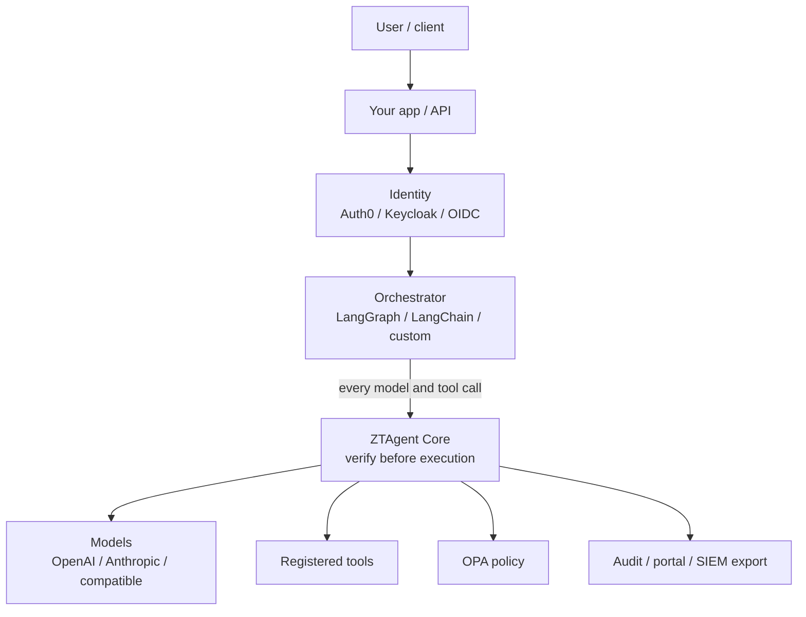
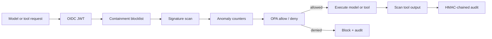
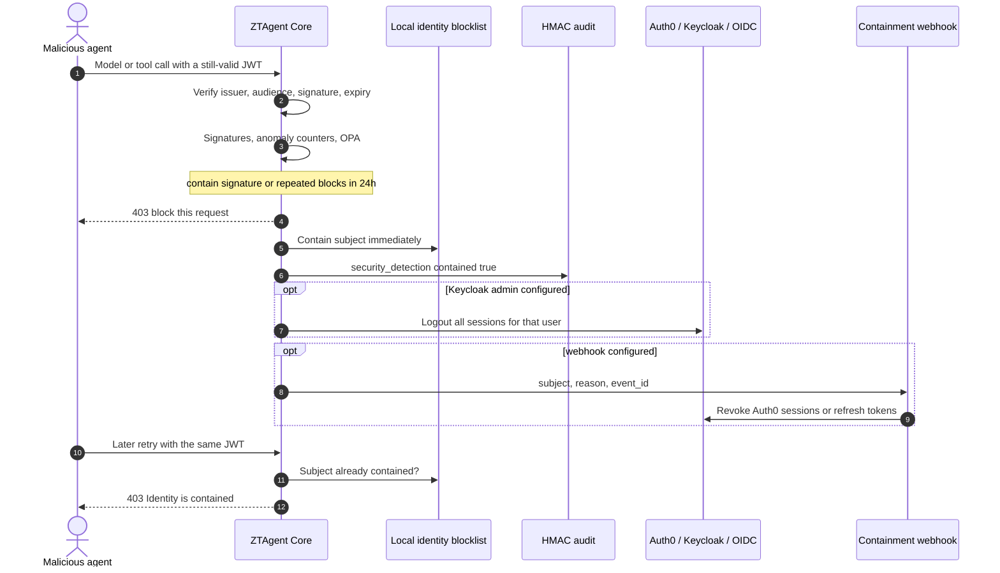

# ZTAgent

**Zero Trust Security for AI Agents**

> Never trust an agent action. Verify before execution.

ZTAgent is an open-source security framework for AI agents, from small developer
projects to enterprise systems. Originally developed by **[Victor Fang](https://VictorFang.com)**
in 2026.

- Product: [https://ztagent.ai](https://ztagent.ai)
- Open source: [https://github.com/victorfang/ztagent](https://github.com/victorfang/ztagent)
- Contact the ZTAgent.ai team: [https://forms.gle/Bq4XNxcSVD2aHrrK6](https://forms.gle/Bq4XNxcSVD2aHrrK6)
- Author: [VictorFang.com](https://VictorFang.com) ·
  [X](https://X.com/vicfcs) ·
  [LinkedIn](https://www.linkedin.com/in/drvictorfang)

This repository is the Apache-2.0 **ZTAgent Core** gateway at the center of
ZTAgent. The PyPI package is [`ztagent`](https://pypi.org/project/ztagent/);
the import remains `ztagent_core`. It puts one enforcement pipeline in front of
model and tool calls, with useful secure defaults, without replacing your
identity provider, reverse proxy, model host, or SIEM.

```bash
pip install ztagent
ztagent --help
```

## Editions and services

| Offering | What it is |
|---|---|
| **ZTAgent Core** (this repository) | Apache-2.0 foundation you can self-host, audit, and extend |
| **ZTAgent Enterprise** | Commercial edition for production organizations (coming) |
| **Consulting** | Custom policy, tools, threat modeling, and deployment help |

Use Core when you want a compact, inspectable security boundary. Enterprise is
planned for teams that need vendor-supported controls beyond the open-source
core. Until that ships, [ztagent.ai](https://ztagent.ai) offers consulting to
customize the gateway for your identity, policy, and tool landscape.

Contact the ZTAgent.ai team:
[https://forms.gle/Bq4XNxcSVD2aHrrK6](https://forms.gle/Bq4XNxcSVD2aHrrK6)

> This is a security foundation, not a claim that signature matching makes an AI
> system completely safe. Prompt injection is not a solved problem. Layer the
> gateway with least-privilege tools, sandboxing, egress controls, human approval
> for consequential actions, and application-specific evaluation.

## Where ZTAgent sits in the AI agent stack

ZTAgent is the **policy enforcement point** between your orchestrator (LangGraph,
LangChain, or a custom loop) and every model or tool call. It does not replace
the identity provider, reverse proxy, model host, or SIEM.



Inside ZTAgent the request is verified, then allowed or blocked:



Bypass is a missed edge: if LangGraph still calls OpenAI or a webhook directly,
ZTAgent never sees the action.

## Detect, contain, and revoke a malicious agent

A stolen or abused Auth0 (or Keycloak) token can still pass JWT checks. ZTAgent
does not trust that token for execution. When a **contain** detection fires —
destructive-command signatures, or enough blocked events in 24 hours — it stops
the current call, writes the JWT `sub` to a local blocklist, then asks identity
to kill sessions. Local deny is applied first, so an Auth0 or Keycloak outage
cannot restore access.



Core Open Source implements the local blocklist and Keycloak session logout.
Auth0 (and other IdPs) are revoked through `containment.webhook_url` — point
that at a small Automation/SOAR job that calls the Auth0 Management API. The
gateway remains closed even if that webhook fails. An administrator unblocks a
subject through the protected admin API after review.

## Three ways to use ZTAgent

Pick one path. You can start with 1 and move to 2 or 3 later; the same
signatures, tool registry, and gateway code sit underneath.

| Path | You have | You add | Minimum extras |
|---|---|---|---|
| **1. Standalone** | A prompt, an OpenAI (or compatible) key | `ztagent serve` as the agent API + admin portal | Audit HMAC key. OPA/Docker optional in development |
| **2. Integrate an existing app** | LangGraph / LangChain, Auth0 (or Keycloak), your tools | Wrap model and tool edges with the ZTAgent gateway | OIDC issuer, audience, JWKS. Do not take identity from graph state |
| **3. Import modules only** | Your own server and orchestrator | Call `SignatureScanner`, `ToolRegistry`, or `SecureAgentGateway` in-process | No FastAPI process required |

Hands-on attack examples (injection, malicious tools) are in
[docs/tutorial.md](docs/tutorial.md). Architecture detail is in
[docs/architecture.md](docs/architecture.md).

### 1. Standalone ZTAgent

Use this for a new project or a demo. ZTAgent owns the HTTP API, model call,
optional tools, audit log, and portal. Development defaults leave authentication
off and allow running without OPA.

```bash
python -m venv .venv
source .venv/bin/activate
pip install -e .
cp .env.example .env
# OPENAI_API_KEY=...
# ZTAGENT_AUDIT_HMAC_KEY=$(ztagent secret)
ztagent check
ztagent serve
```

Open <http://127.0.0.1:8000/admin>. Call `/v1/agent/run` with a user message.
You do not need Auth0, LangGraph, or Docker for this path. Turn on OIDC and
fail-closed OPA before production (`server.environment: production`).

`ztagent init my-agent` scaffolds the same files in a new directory.

### 2. Integrate LangGraph, Auth0, and your app

Keep your identity provider and graph. Insert ZTAgent as the **only** path to
models and side-effecting tools so the graph cannot bypass policy.

1. Point `auth` at Auth0 (or Keycloak): `issuer`, `audience`, `jwks_url`,
   `algorithms: [RS256]`, and `role_claim` matching your token
   (`permissions`, `realm_access.roles`, or a custom namespaced claim).
2. Verify the access token, then build `Principal` from that result — never from
   model output or LangGraph state.
3. Put `as_langchain_runnable(gateway, principal)` on the model node. Send
   high-risk tools through `gateway.execute_tool(...)`, not raw HTTP/SDK calls.

```bash
pip install 'ztagent[langchain]'
# From this repository: pip install -e '.[langchain]'
```

```python
from ztagent_core.api import create_gateway
from ztagent_core.auth import JWTAuthenticator
from ztagent_core.config import load_config
from ztagent_core.integrations import as_langchain_runnable

config = load_config()
gateway = create_gateway(config, tools=registry)
principal = JWTAuthenticator(config.auth).verify(access_token)  # Auth0 JWT
secure_node = as_langchain_runnable(gateway, principal)

# LangGraph: attach secure_node as the model edge.
result = await secure_node.ainvoke({"messages": [{"role": "user", "content": "Hello"}]})
```

Auth0 example `config/agent.yaml` fragment:

```yaml
auth:
  enabled: true
  issuer: https://YOUR_TENANT.auth0.com/
  audience: ztagent-core
  jwks_url: https://YOUR_TENANT.auth0.com/.well-known/jwks.json
  algorithms: [RS256]
  role_claim: permissions
```

The same pattern works with Keycloak or any OIDC provider that issues RS256
access tokens. See [docs/tutorial.md](docs/tutorial.md#2-integrate-with-langgraph-auth0-and-existing-apps).

### 3. Import only the modules you need

Use this when you already have an API and only want selected controls — for
example prompt-injection scanning — without running `ztagent serve`.

```python
from pathlib import Path
from ztagent_core.guardrails import SignatureScanner
from ztagent_core.tools import ToolRegistry, ToolSpec

scanner = SignatureScanner.from_file(Path("config/signatures.yaml"))
findings = scanner.scan(user_prompt)
if any(item.action in {"block", "contain"} for item in findings):
    raise PermissionError("Request blocked by ZTAgent signatures")
```

Other drop-in pieces: `ToolRegistry` / `ToolSpec` (schema-validated tools),
`SecureAgentGateway` (full PEP without FastAPI), `JWTAuthenticator`,
`AuditLog`, `AnomalyDetector`, `ContainmentService`, `OPAClient`. You are
responsible for calling them on **every** model and tool path; a missed edge is
a bypass.

## What is included

- FastAPI-based API gateway with request limits and security headers
- OIDC JWT validation for Keycloak, Auth0, and compatible identity providers
- OPA policy enforcement point/client with fail-closed production defaults
- Registered, schema-validated tool gateway with risk metadata
- YAML signature rules with Unicode normalization and regex timeouts
- OpenAI Responses, Anthropic Messages, and OpenAI-compatible model APIs
- Optional LangChain `Runnable` adapter; the core remains orchestrator-neutral
- Stateless request heuristics and memory/SQLite rolling 24-hour counters
- HMAC-chained JSONL audit records with default secret/prompt redaction
- Local identity containment, Keycloak session logout, and a webhook for Auth0 or SOAR revocation
- Protected, dependency-free web administration portal
- Friendly project wizard and operational checks

## Quick start (standalone)

Requires Python 3.11+. For the standalone path you only need an OpenAI (or
compatible) API key and an audit HMAC key. Docker/OPA is optional until you
disable the development policy bypass.

```bash
python -m venv .venv
source .venv/bin/activate
pip install ztagent
# From this repository, developers can instead: pip install -e .

# Create a separate starter project, or use this repository's included example.
ztagent init my-agent
cd my-agent
cp .env.example .env
# OPENAI_API_KEY=sk-...
ztagent secret                         # put output in ZTAGENT_AUDIT_HMAC_KEY
set -a; source .env; set +a
ztagent check
# Optional until you disable the OPA development bypass:
# docker compose up -d
ztagent serve
```

Open <http://127.0.0.1:8000/admin>. Development defaults disable authentication;
the portal therefore uses a development administrator. Production configuration
validation refuses disabled authentication or an OPA bypass.

Call the gateway (no bearer token required in standalone development):

```bash
curl http://127.0.0.1:8000/v1/agent/run \
  -H 'Content-Type: application/json' \
  -d '{"messages":[{"role":"user","content":"Summarize this report"}]}'
```

## Provider setup

Set `provider.kind` in `config/agent.yaml`:

| Provider | `kind` | Key environment variable | Notes |
|---|---|---|---|
| OpenAI | `openai` | `OPENAI_API_KEY` | Uses `/v1/responses`, with storage disabled |
| Anthropic | `anthropic` | `ANTHROPIC_API_KEY` | Uses `/v1/messages` |
| Kimi/self-hosted | `openai-compatible` | configurable | Set the server's `/v1` `base_url` |

Models are deny-by-default: a requested model must appear in `allowed_models`.
API keys are read only from environment variables and are never returned or
written to audit events.

## Identity and policy

On the **standalone** path, leave `auth.enabled: false` only in development.
On the **integrate** path, configure the issuer, audience, JWKS URL, fixed
asymmetric algorithms, and role claim under `auth` for Auth0, Keycloak, or
another OIDC provider. ZTAgent verifies signature, expiration, issued-at,
issuer, audience, and subject. Do not derive accepted JWT algorithms from a
token.

The gateway is the policy enforcement point (PEP). It sends only identity,
roles, action, resource metadata, source IP, and request ID to OPA (the PDP).
Prompts and tool arguments are not sent to OPA. The starter Rego policy allows:

- authenticated model calls;
- low/medium-risk tools for authenticated identities;
- high-risk tools only for the `ztagent-tool-admin` role.

Tailor `policies/authz.rego` to tenant, model, tool, data classification, and
business approval requirements. OPA is bound to loopback in `compose.yaml`.

## Add a tool

```python
from pydantic import BaseModel
from ztagent_core.tools import ToolRegistry, ToolSpec


class LookupArgs(BaseModel):
    ticket_id: str


registry = ToolRegistry()
registry.register(
    ToolSpec(
        name="lookup_ticket",
        description="Read one support ticket",
        arguments=LookupArgs,
        handler=lambda args: {"id": args.ticket_id},
        risk="low",
    )
)
```

Pass the registry to `create_gateway(config, registry)`. For standalone, also
pass it to `create_app(config, gateway)`. For LangGraph, keep the same registry
on the gateway the graph calls. Every `/v1/tools/{name}` request (and
`gateway.execute_tool`) receives authentication, signature scanning, OPA
authorization, validation, and audit. The registry intentionally has no shell,
filesystem, or arbitrary HTTP tool.

## LangChain / LangGraph

The optional adapter is a LangChain `Runnable`, so it works as a LangGraph node.
See [path 2](#2-integrate-langgraph-auth0-and-your-app) above. The application
must derive `principal` from a verified request; never accept identity or roles
from model output or untrusted chain state.

## Before/after demo agents

Install the demo extra and run three small LangChain applications:

```bash
pip install 'ztagent[demos]'
# From this repository: pip install -e '.[demos]'
ztagent demo stock-injection
ztagent demo unauthorized-publish
ztagent demo article-only
```

Each command contrasts a deliberately vulnerable baseline with the protected
framework path. The examples cover an indirect prompt injection hidden in stock
data, unauthorized article publishing, and a safe article-only workflow.
Email, DM, and social actions always remain in a local JSONL sandbox.

Use `--live` to exercise the configured OpenAI API or stay with the default
deterministic offline model for a repeatable, credential-free security demo.
See [docs/tutorial.md](docs/tutorial.md) for a step-by-step walkthrough of
configuration, prompt injection, and malicious tool use. See
[docs/demos.md](docs/demos.md) for expected output, the exact controls being
demonstrated, and important limitations.

## CLI

```text
ztagent init [DIRECTORY]   Generate config, signatures, Rego, Compose, and app files
ztagent secret             Generate a strong audit HMAC key
ztagent check              Validate configuration and signatures; flag dev bypasses
ztagent demo               Compare vulnerable and secured LangChain demo agents
ztagent serve              Start the gateway and portal
```

## Architecture and security scope

See the [hands-on tutorial](docs/tutorial.md) for configuration, prompt-injection
blocks, malicious tool use, and audit examples. See
[docs/architecture.md](docs/architecture.md) for the request flow, threat
coverage, design decisions, limitations, deployment checklist, and research
references. See [SECURITY.md](SECURITY.md) for vulnerability reporting and
operational security guidance. The
[blast-radius threat-modeling tutorial](docs/blast-radius-threat-modeling.md)
provides worked examples for the included agents.

## Development

```bash
pip install -e '.[dev]'
ruff check .
mypy
pytest
```

Apache-2.0 licensed. Product: [ZTAgent](https://ztagent.ai) ·
source: [github.com/victorfang/ztagent](https://github.com/victorfang/ztagent).
